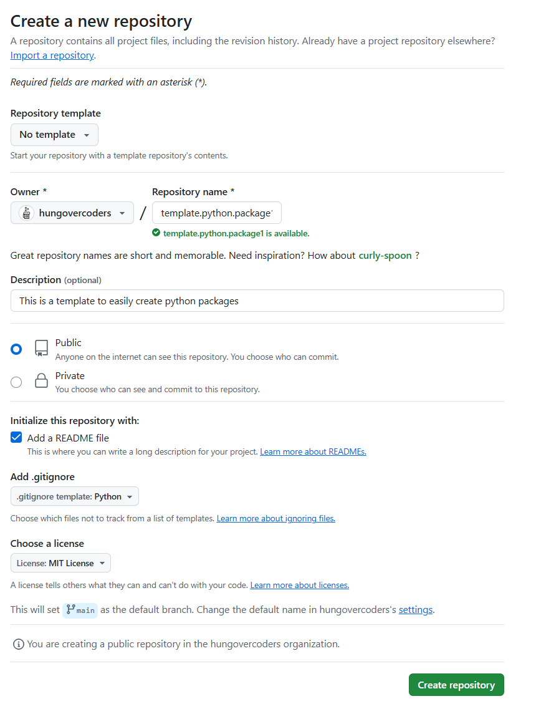
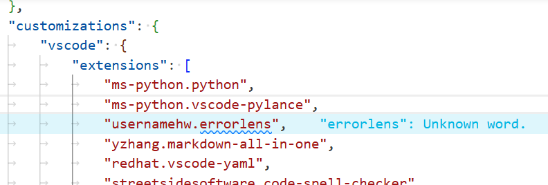
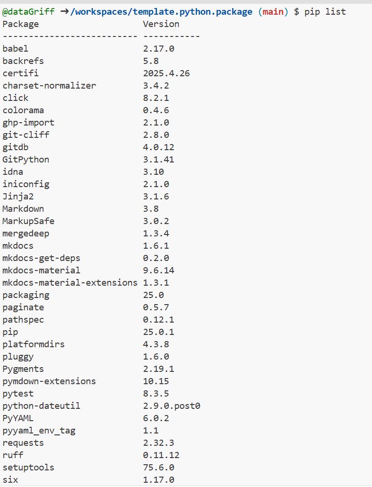
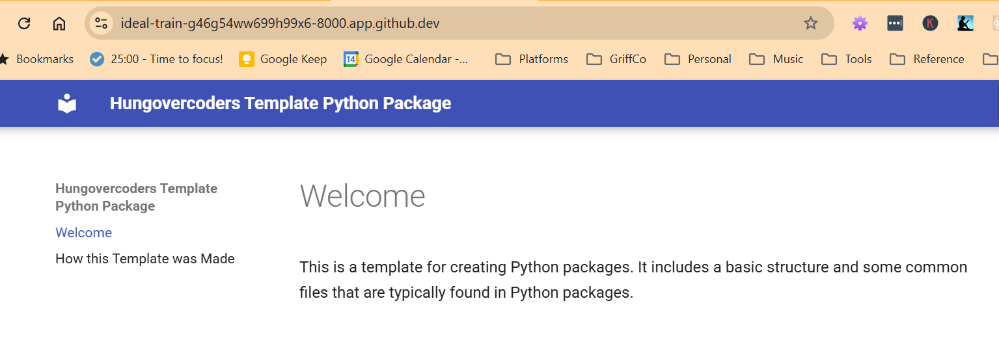
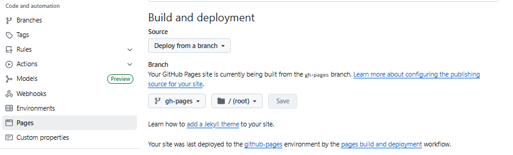
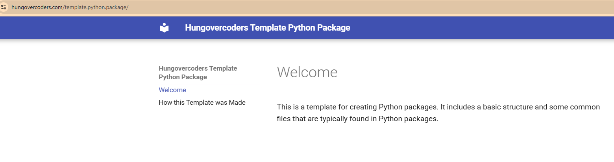

# How this Template was Made

## Initialise Repo and Environment

1. **Created a new repository on [GitHub](https://github.com/).**
      - Gave an appropriate name and description.
      - Added a README file.
      - Added a .gitignore file for Python.
      - Selected a license (MIT License).

    

1. **Added [Copilot Context File](https://docs.github.com/en/copilot/customizing-copilot/adding-repository-custom-instructions-for-github-copilot)**
      - Created a [`.github/copilot-instructions.md`](https://github.com/hungovercoders/template.python.package/blob/main/.github/copilot-instructions.md){target="_blank"} file to provide context for Copilot.

1. **Opened in codespaces and amended environment configuration.**
      - Added a [`devcontainer.json`](https://github.com/hungovercoders/template.python.package/blob/main/.devcontainer/devcontainer.json){target="_blank"} file to configure the development environment using [devcontainers](https://code.visualstudio.com/docs/remote/devcontainer){target="_blank"} standards in [vs code](https://code.visualstudio.com/docs/devcontainers/containers){target="_blank"}.
      - Added a [requirements_dev](https://github.com/hungovercoders/template.python.package/blob/main/.devcontainer/requirements_dev.txt){target="_blank"} file for the packages required for development.
      - Added a [requirements_docs](https://github.com/hungovercoders/template.python.package/blob/main/.devcontainer/requirements_docs.txt){target="_blank"} file for the packages required for documentation.

1. **Reopened the codespace to confirm devcontainer configuration**
    - Confirmed VS code extensions installed.
    - Leveraged errorlens and spell checker to clean-up any markdown or spelling errors.

    

    - Confirmed package requirements installed in the codespace.
  
    ```bash
    pip list
    ```

    

## Published Documentation

1. **Created documentation**
      - Created a [`mkdocs.yml`](https://github.com/hungovercoders/template.python.package/blob/main/mkdocs.yml){target="_blank"} file to configure the documentation.
      - Created a `docs` directory with an initial [`index.md`](https://github.com/hungovercoders/template.python.package/blob/main/docs/index.md){target="_blank"} file.
      - Built the documentation using:

      ```bash
      mkdocs build --strict
      ```

      - Served the documentation locally to confirm it works:

      ```bash
      mkdocs serve --strict
      ```

      

2. **Published documentation to GitHub Pages**
      - Enabled GitHub Pages in the repository settings, selecting the `gh-pages` branch as the source.

      

      - Created a `.github/workflows/gh-pages.yml` file with the necessary steps to build and deploy the documentation to the github pages branch configured above.
      - Committed and pushed changes to trigger the workflows.
      - Confirmed the documentation is available at `https://<username>.github.io/<repository-name>/`. e.g. [https://hungovercoders.github.io/template.python.package/](https://hungovercoders.github.io/template.python.package/){target="_blank"}

      

## Created Changelog

1. **Create a [`docs/changelog.md`](https://github.com/hungovercoders/template.python.package/blob/main/docs/changelog.md){target="_blank"} file**
      - Created a cliff.toml file to configure the changelog.
      - Confirmed working by running:

      ```bash
      git-cliff -c cliff.toml
      ```

      - Can see changelog file populated.

2. **Added a GitHub Action to automatically generate the changelog**
      - Amended `.github/workflows/gh-pages.yml` file to include a step to generate the changelog automatically.

## Initialise Package

```bash
uv init --lib hungovercoders_template_python_package
```

## Publish Package to PyPI
